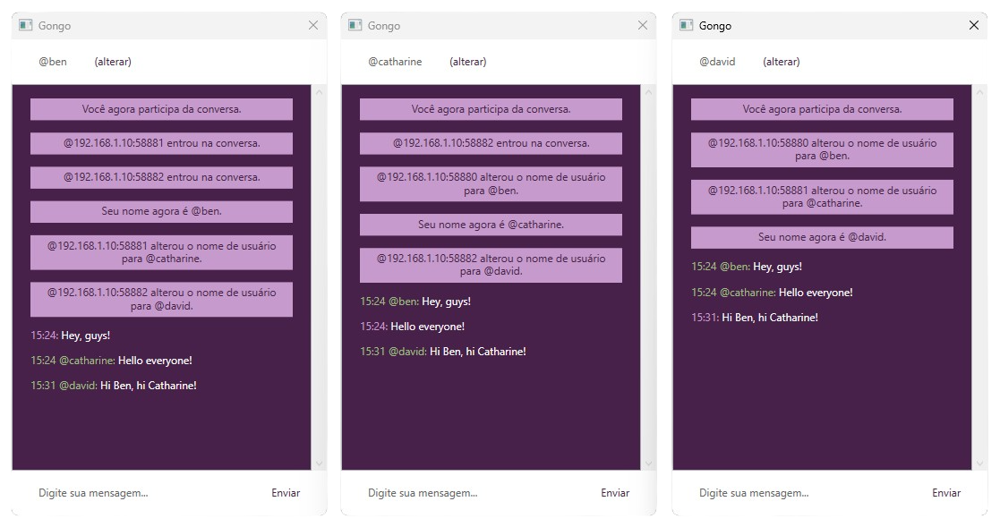

# Gongo

 



[[Ver em Português](README.md)]

**Gongo** is a simple chat built in C# for the purpose of learning about sockets during the Computer Networks course at [Federal University of Jequitinhonha and Mucuri Valleys](http://portal.ufvjm.edu.br/).

It is an app provided with a client-server architecture that allows multiple users to communicate simultaneously through the TCP protocol. So far, the only supported language for **Gongo** is Portuguese (Brazil).

## Requirements

- .Net Framework 4.8
  
> The software was tested in a Windows environment. If you have problems running in other environments, [contact us](#contact).

## Installation

Clone the repository:

```
$ git clone https://github.com/davidsonbrsilva/gongo.git
```

Access the project root folder:

```
cd gongo
```

Build the app:

```
dotnet build
```

## Usage quick guide

There are two executable projects in the same solution, **Gongo Server** and **Gongo Client**. Start the `GongoServer.exe` file to run the application server. Then open the `GongoClient.exe` file to start a conversation.

_Gongo Client_ will use your local IP as the username by default, but you can change this at any time. Just click `(alterar)`, type the new username you want in the message field and click `Confirmar`.

Messages sent by you are displayed in purple and messages sent by other users are green.

You can simulate a conversation between multiple users by initiating and sending messages through more than one instance of _Gongo Client_.

## Gongo settings files

_Gongo Server_ and _Gongo Client_ look for their respective configuration files before starting the application.

### Gongo Server settings file

By default, _Gongo Server_ will receive connections from any IP address and listen for them on port `22777`. However, you can override these settings.

To do so, create a file called `ServerSettings.json` in the same directory where the _Gongo Server_ executable file is located, with the following structure:

```json
{
    "host":"any",
    "port":"<your_custom_port>"
}
```

By specifying `any` in the `host` property, you tell _Gongo Server_ that you want to receive connections from any IP address. You can also inform an IP address so that _Gongo Server_ only receives connections from this specific one.

Remember that if you use a different port for the Gongo Server, the _Gongo Client_ instances must also connect to the same port released by the server.

### Gongo Client settings file

By default, _Gongo Client_ will assume that _Gongo Server_ is running on your local machine and will try to connect to your IP on the server's default port (22777).

To change this, create a settings file in the same directory as the _Gongo Client_ executable called `ClientSettings.json` with the following structure:

```json
{
    "host":"<gongo_server_ip>",
    "port":"<gongo_server_port>"
}
```

## Contact

If you need, send an e-mail to <davidsonbruno@outlook.com>.

## License

[MIT](LICENSE.md) Copyright (c) 2019, Davidson Bruno.
